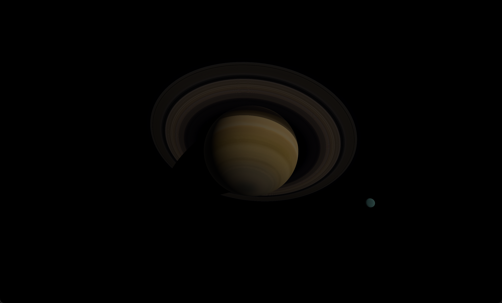
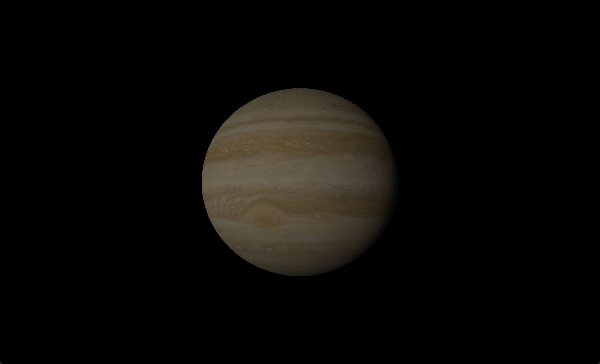

# Orrery

A real-time 3D solar system where the Sun, planets and the Moon are placed by the mathematical models used to predict the sky. Nothing is
hand-animated or keyframed, the positions are calculated and the scene follows the mathematics.

<p>
  
  
</p>

## Why build this?

The solar system is hard to see. The distances are extremely large, the bodies can be small and the time scales are slow. Every visualization has to choose what to lie about and these choices shape what's understood.

I wanted to build a visualization that starts from completely real data and works
backwards to something more understandable. Whether compressing scale so Mercury
and Neptune can share a frame, lighting a body 4 billion kilometres
from the Sun or, what Saturn's rings do when sunlight passes through
ice particles at a shallow angle; all these choices require the reconciliation of real data with aesthetic direction.

## What you can see

The Sun, eight planets, Earth's Moon, and Saturn's rings. You can orbit the
camera around any body, pause time, speed it up to a year per second,
jump to the present day or return to the J2000 epoch.

More detailed textures, accurate starfield, date selector, additional moons (the Galileans, Titan) and controller support are on the roadmap.

## The science

Planetary positions are derived from VSOP87E, an analytical ephemeris theory
that gives barycentric coordinates: positions measured from the solar
system's centre of mass, as the Sun itself moves, pulled primarily by Jupiter, orbiting the barycentre by roughly one solar radius. The Moon's position comes from ELP82, a dedicated lunar theory. The project validates its positions against NASA's JPL Horizons ephemeris service, holding the inner planets to about 10 arcseconds, with relaxed tolerances for Uranus and Neptune.

The simulation tracks seven astronomical time scales with leap-second handling and corrections between Earth-centred and solar-system barycentric time. Some scale conversions are simplified: UT1 assumes a zero offset from
UTC (accurate to under a second), and the TDB-TT relativistic correction
uses a millisecond-level formula. "Where is Mars?" depends on both the time system and the coordinate frame you're using, so the project maintains
reference-frame transforms between equatorial, ecliptic, and body-fixed
coordinates, with IAU rotation models orienting each body's surface.

## Visual interpretation

The Sun is one million times Earth's volume and at true scale Neptune would be invisible, a speck 30 AU away. Instead adaptive scaling is used: inner planets are spread apart more aggressively than outer ones and moons are enlarged relative to their parent so you can see them orbit.

At the GPU level, the distances involved break conventional 3D
rendering. Floating-point numbers aren't precise enough to place objects
billions of kilometres apart and still render surface detail. The orrery
handles this by placing the camera at the mathematical origin and
computing every position relative to it, keeping precision usable across
four orders of magnitude.

## Rendering

Each body is lit by a shader that tries to match how its surface
responds to sunlight. Rocky bodies like Mercury and the Moon brighten
toward the subsolar point the way regolith does. Venus uses a
reflectance law tuned to its sulfuric acid cloud tops. Gas giants
show subtle limb brightening from light scattering through deep
atmospheres. Ice giants exhibit stronger limb effects from methane
photochemistry. Earth uses atmospheric wrap lighting to soften the
day-night terminator. Material properties like albedo, roughness and colour
come from NASA Planetary Fact Sheets.

The underlying shading uses a Cook-Torrance BRDF with energy
conservation and an opposition surge model that reproduces the
brightening seen when a body is lit head-on, a phenomenon caused by
shadow-hiding among surface particles.

Saturn's rings are the most involved piece of work. Sunlight hitting
the rings passes through a field of orbiting ice particles and what
happens depends on viewing geometry, particle density and which side of
the ring plane you're looking at. The lit side shows back-scattering with
a brightness curve calibrated against Cassini observations. The unlit
side transmits light forward through the ring material, attenuated by
optical depth that varies by region: the dense B ring is nearly opaque
while the C ring lets most light through. When the rings pass
into Saturn's shadow, the planet itself still illuminates them: reflected
sunlight from Saturn's dayside reaches the ring particles, modeled with
a single-scattering radiative transfer formulation. Ring shadow on
Saturn's body uses 5-tap solar-disc sampling.

The Sun uses wavelength-dependent limb darkening, redder at the edges
and bluer at the centre, with a chromosphere glow at the limb.

Tone mapping is applied as a final compositing pass.

## Build and run

```bash
./gradlew run
```

Requires Java runtime (8–24) to launch the Gradle wrapper. Gradle downloads itself and a JDK 17 automatically if needed.

Textures are not stored in the repository. They are packaged as a tarball and attached to a GitHub Release. On first run, the `fetchTextures` Gradle task downloads the tarball, verifies its
checksum and extracts the files into `src/main/resources/textures/`.
Subsequent runs skip the download if the version marker is already
current. The release tag and checksum are configured in `gradle.properties`.

The app launches in borderless fullscreen at the desktop resolution. Start windowed with `./gradlew run -Pwindowed`.

LWJGL debug output can be enabled with `./gradlew run -Pdebug`. Scroll zoom feel can be tuned with `-PzoomSensitivity` and `-PzoomSmoothing`.

## Controls

| Input | Action |
|-------|--------|
| Mouse drag | Orbit camera |
| Scroll | Zoom |
| Left / Right | Cycle focus through bodies |
| Space | Pause / resume time |
| `,` / `.` | Slow down / speed up time |
| `/` | Reset to real-time |
| `1` | Real-time |
| `2` | 1 day/sec |
| `3` | 1 week/sec |
| `4` | 1 month/sec |
| `5` | 1 year/sec |
| `R` | Reset camera |
| `N` | Jump to now |
| `J` | Jump to J2000.0 epoch |
| `F11` (`Cmd`+`Ctrl`+`F` on macOS) | Toggle fullscreen / windowed |
| `Esc` | Quit |

## Tests

```bash
./gradlew test
```

The test suite covers timescale conversions, ephemeris validation against
JPL Horizons reference data, reference-frame round-trips, texture filename
parsing, material catalog integrity and visual scaling curves.

## Technical summary

- Java 17 / LWJGL 3.3.3 / OpenGL 4.1
- Analytical ephemerides: VSOP87E (Sun and planets), ELP82 (Moon)
- Seven time scales (UTC, TAI, TT, TDB, TCB, UT1, GPS) with leap-second table
- Reference-frame transforms (J2000 equatorial, ecliptic, body-fixed) with IAU rotation
- Double-precision astronomical math, float conversion at the GPU boundary
- Camera-relative rendering for precision across astronomical distances
- UBO-based unified shader with Cook-Torrance PBR and per-body surface models
- Saturn ring rendering: optical depth, ice-particle scattering, shadows, Saturnshine, ringshine
- GPU-tier-aware texture backend with DDS, PNG, and ASTC support
- Adaptive visual scaling (power-law distances, piecewise radii)

## License

[MIT](LICENSE).